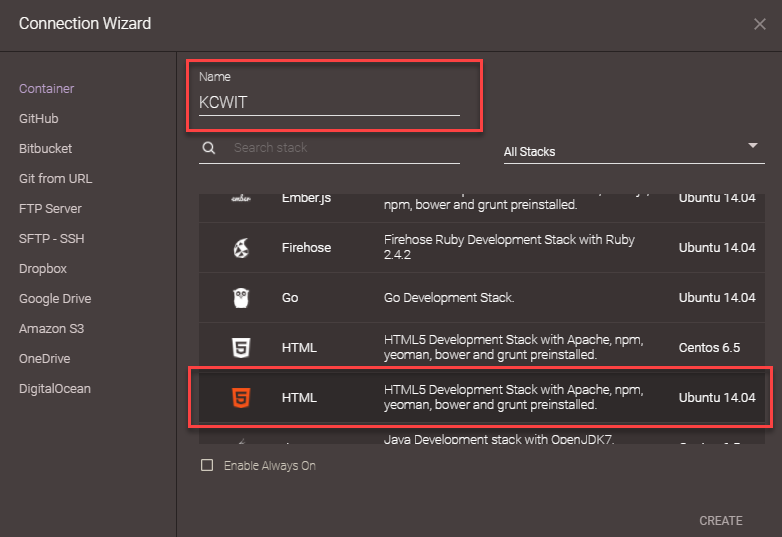
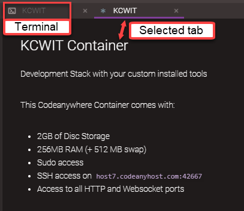
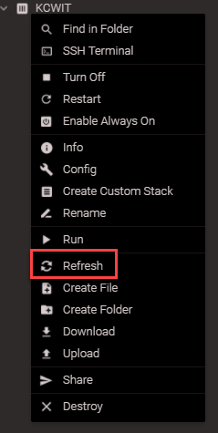

1. Tonight we will use [Codeanywhere](https://codeanywhere.com). Sign up for a Codeanywhere account and log in.

1. In the **Connection Wizard** dialog, enter the name "KCWIT" and select "HTML5 Development Stack with Apache, npm, yeoman, bower and grunt preinstalled Ubuntu 14.04" as shown in the picture below. Press **CREATE**.

   

1. You will see two tabs named "KCWIT". Leave both tabs open. The **KCWIT Container** tab that displays shows the address for the container. We will use this later in the worksheet. Select the tab with the <span class="octicon octicon-terminal"></span> icon. This is your terminal.

   

1. We need to install the toolsets that we will use tonight. Copy all the code below and paste into the terminal using `Shift` + `search` + `.`. The terminal will start executing. Press `Enter` so the commands finish executing.
   ```bash
sudo apt-get update
curl -o- https://raw.githubusercontent.com/creationix/nvm/v0.33.8/install.sh | bash
nvm install node
   ```

   
Feel free to grab a mentor to help guide you through this step.
   

1. In the terminal, type `node --version` and press `Enter` to verify node installed properly. You should be version 10 or greater.

1. Type `npm --version` and press `Enter`. You should be version 6 or greater.

1. Create a "CodingAndCocktails" folder by typing `mkdir CodingAndCocktails` <i class="fa fa-share fa-rotate-180"></i>.
   
The <i class="fa fa-share fa-rotate-180"></i> icon tells you when to press `Enter`.
   

1. Navigate into the directory by typing `cd CodingAndCocktails` <i class="fa fa-share fa-rotate-180"></i>.

1. Create an "trivia-api" folder by typing `mkdir trivia-api` <i class="fa fa-share fa-rotate-180"></i>.

1. Navigate into the "trivia-api" directory by typing `cd trivia-api` <i class="fa fa-share fa-rotate-180"></i>.

1. Right click on "KCWIT" container and select **Refresh**. This will show all your new folders and files in the left pane. You can now drag and drop files between folders in this pane. You will have to manually refresh the view every time you create or make changes to folders and files in the terminal.

   

   
Your container may automatically turn off if you leave it idle for too long. Right click on "KCWIT" container and select **Restart**. You will have to navigate to the correct directory and depending on how long the container was idle, you may have to reinstall Node and npm. Check steps 5 & 6 above on how to check the Node & npm versions.
   

1. You will use the built in code editor tonight. 
   
CodeAnywhere will help you identify unsaved work for each file by showing a little circle by the filename.
   

1. Pick up with the worksheet starting at [Initialize the Project- package.json](/worksheet/part_1_setup.html#packagejson).
