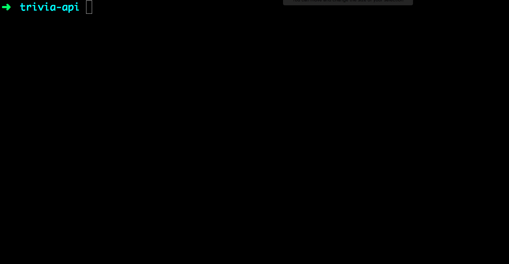

## Prepare your workspace

<!-- trick markdown to give me a little space between these two sections of text -->
## 

Before starting the worksheet, please take a moment to review [Setup instructions](/setup) to ensure you have all the tools and workspace setup you need for tonight's work.



1. In your Command Line Interface (aka CLI: That means Cmder or iTerm2), navigate to your "CodingAndCocktails" folder by typing: 

     
cd ~/CodingAndCocktails
    
cd %USERPROFILE%/CodingAndCocktails
   

  
  Then press `Enter`. You will need to press `Enter` after any command you enter in the command line.

  
  #### Command line woes?
  - Your home directory is:
    - Mac: `/users/<yourUsername>`
    - Windows: `C:/<yourUsername>`
  - Command to change folders: `cd <folderToGoTo>`
  - Command to make a folder: `mkdir <newFolder>`
  - You can also use **~** for Mac or **%USERPROFILE%** for Windows as a shortcut in CLI for your home directory: `cd ~` for Mac and `cd %USERPROFILE%` for Windows.

  Revisit the command line worksheet from March:
  [bit.ly/CnCMarWork](http://bit.ly/CnCMarWork)
  

2. Make a new folder named "trivia-api". 

  iTerm2/Cmder
  ```bash
  mkdir trivia-api
  ```

3. Navigate into that new folder.

  iTerm2/Cmder
  ```bash
  cd trivia-api
  ```

  
If you start typing the name of a folder or file, press `Tab` and it will autocomplete.  

Above, if you had typed `cd tri` and then press `Tab` it would have completed to `cd trivia-api` for you!
  
  
4. Download and install [Postman](https://www.getpostman.com/apps). Select the Download button in the section for your Operating System (Mac or Windows). 

  
**CodeAnywhere users** instead of downloading Postman you'll use a different command that we'll specify when needed.
  
  
## package.json

1. To start the project, we need to initialize it.  Doing this will create a _package.json_ file which will enable us to install and use some **npm** packages and store data about the project.

  
If you were here last month, you might remember the _package.json_ and talking about how packages work! 

  [Click here to view last month's worksheet on package managers](http://bit.ly/CnCAugWork)
  

  Type:

  iTerm2/Cmder
  ```bash
  npm init
  ```
  
2. This command will prompt you for values to populate the _package.json_ file.

 The first prompt is `package name: (trivia-api)`. It may not be obvious that the CLI is prompting you for input there but it is. 

  Press the `Enter` key to use the default value for the first three prompts only. 
  
3. The 4th prompt is one we want to change, `entry point: (index.js)`. For that prompt, type **server.js** followed by the `Enter` key.

  Press `Enter` for the remaining prompts unless you'd like to enter your name at the `author:` prompt.  Make sure you also press `Enter` for the last prompt `Is this ok? (yes)`
  
  

## Install Packages
1. There are a few packages that we are going to use in this project.  These are bits of code that other developers have created and we are able to pull in and use in our project so that we don't have to try to reinvent the wheel. Type:

  Cmder/iTerm2
  ```bash
  npm install cors express lodash node-fetch --save
  ```
  
For additional context on the packages used take a look at their pages on the npm website:
  * cors: https://www.npmjs.com/package/cors
  * express: https://www.npmjs.com/package/express
  * lodash: https://www.npmjs.com/package/lodash
  * node-fetch: https://www.npmjs.com/package/node-fetch
  

2. Install the `nodemon` package as a dev dependency. This package will allow you to restart your server when files change without having to manually do so. Type:

  Cmder/iTerm2
  ```bash
  npm install nodemon --save-dev
  ```
  
  
DevDepencency: A tool that used only during the development of your project. This is something that is not necessary to run your application.

Dependency: A required tool or piece of code to make your application work.
  

3. Open Atom via the command line

  
**CodeAnywhere users:** You will use the built in text editor. Don't forget to refresh the container to see changes you made from the terminal.
  

  Cmder/iTerm2
  ```bash
  atom .
  ```
  
Command not found

If Atom doesn't open (but you know it's installed), your system likely doesn't recognize the `atom` command.

You can configure your system to recognize the command (ask a mentor for help) or you can follow these steps to open it manually:
  1. From your applications or start menu, open Atom.
  2. In Atom: **File** <i class="fa fa-long-arrow-right"></i> **Open...** (Mac) or **Open Folder...** (Windows).
  3. Open the "trivia-api" folder.
  4. Click the **Open** button.
  

4. Double click on the _package.json_ file in the left side Project pane to open the file for editing.

5. Add an npm script to enable you to run nodemon quickly in the command line.  To add an npm script it must go inside the curly braces after the `scripts` label.
  * At the end of the line that starts with the `"test":` key, add a comma `,` and then press `Enter` to move to the next line.
  * On the next line, type out the following to add the nodemon script:

  Atom | package.json
  ```json
  "nm": "nodemon server.js"
  ```
  
  Don't forget to save the changes!

8. Great work!  Compare your _package.json_ with the [Part 1 Answer key](https://github.com/KansasCityWomeninTechnology/trivia-api/tree/answer-key-part-1).
